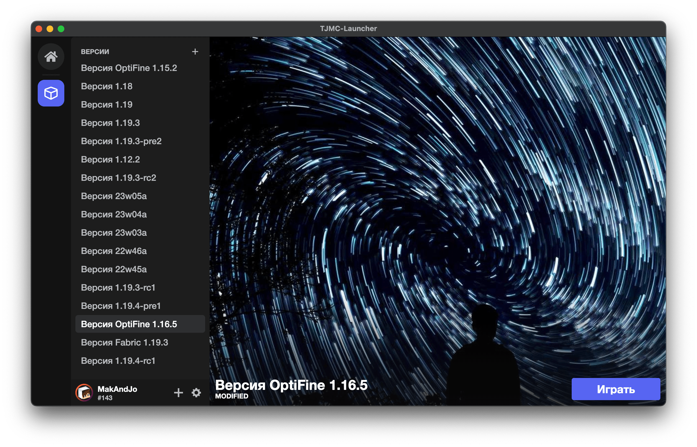

# TJMC-Launcher
<p align="center">
  
  
</p>

## About project ✨
This project was originally created by [MakAndJo](https://github.com/MakAndJo) and then moved to [TJMC-Company](https://github.com/tjmcraft) (for *non-commercial* purpose only). \
**TJMC-Launcher** is a simple to use, extremely fast, and well supported app, that allows you to install **pure** and **modded** versions of **Java Minecraft**. \
**Current status:** [MVP+](https://ru.wikipedia.org/wiki/%D0%9C%D0%B8%D0%BD%D0%B8%D0%BC%D0%B0%D0%BB%D1%8C%D0%BD%D0%BE_%D0%B6%D0%B8%D0%B7%D0%BD%D0%B5%D1%81%D0%BF%D0%BE%D1%81%D0%BE%D0%B1%D0%BD%D1%8B%D0%B9_%D0%BF%D1%80%D0%BE%D0%B4%D1%83%D0%BA%D1%82)

## Download 💿
If you are looking to install **TJMC-Launcher** without setting up a development environment, you can consume our binary [releases](https://github.com/tjmcraft/TJMC-Launcher/releases).

## Tasks 📑
### UI improvements:
- [x] Implement **Context Menu** on **Installations**
- [x] Implement **Full Delete** action on **Installations** (deep delete -> all dependencies)
- [x] Implement **Edit** action on **Installations**
- [x] Implement open current installation folder
- [ ] Fix accessibility issues (aria tags + tab navigation)
- [ ] Implement font resize + *accent color change*
- [x] Fix non-centred main window on first start #28
- [x] Fix fullscreen after reloading UI #27
- [ ] Move **Settings** to separate layer (not modal)
- [ ] Add versions search
- [ ] Add Installations search
- [x] Full support hot keys
### Host improvements:
- [x] Create **JavaManager**, that can **install** required java and also scan **installed** versions
- [x] Fix Forge and other *modded* builds startup issues
- [x] Fix directories bug and create directories setting
- [x] Installations:
  - [x] Prevent loading same installation as a second instance in host launcher (strict)
  - [x] Implement installations load queue #34
  - [x] Implement *last-used* time on **Installation** #31
- [ ] Auth improvements:
  - [x] Update **Auth** system (move to host as auth server + oauth on web)
  - [x] Offline account support
  - [x] Connect to keytar store
  - [x] Implement multi-account store
  - [x] Refresh token support #33
  - [ ] Implement next **TCHost** (WebRTC) under Host (need for host auth system to authorize in signaling server)

## Developing 💻

### Downloading the source code:

Clone the repository with `git`:

```sh
git clone https://github.com/tjmcraft/TJMC-Launcher
cd TJMC-Launcher
```

To update the source code to the latest commit, run the following command inside the `TJMC-Launcher` directory:

```sh
git fetch
git pull
```

### Available Scripts:
`npm run start` - Runs the app in the normal mode \
`npm run build` - Build electron app with default config \
`npm run build:win` - Build electron app for windows only \
`npm run build:mac` - Build electron app for darwin only \
`npm run build:linux` - Build electron app for linux only \
`npm run build:linux-snap` - Build electron app for linux for snap store \
`npm run serve-render:dev` - Serve UI on dedicated server \
`npm run watch-render:dev` - Start watching UI in dev mode for dist build \
`npm run build-render:dev` - Build UI in dev mode for dist build \
`npm run build-render:prod` - Build UI in production mode for dist build \
`npm run deploy` - Build and publish electron app with default config \
`npm run deploy:win` - Build and publish electron app only for windows \
`npm run deploy:mac` - Build and publish electron app only for darwin \
`npm run deploy:linux` - Build and publish electron app only for linux \
`npm run deploy:linux-snap` - Build and publish electron app for linux and publish to snap store \
`npm run deploy:multi` - Build and publish electron app for all available platforms

## Libraries 📦

### Used libraries for **Host**:
 - [**Electron**](https://github.com/electron/electron)
 - [electron-builder](https://github.com/electron-userland/electron-builder)
 - [adm-zip](https://github.com/cthackers/adm-zip)
 - [fs-extra](https://github.com/jprichardson/node-fs-extra)
 - [got](https://github.com/sindresorhus/got)
 - [md5](https://github.com/pvorb/node-md5)
 - [ws](https://github.com/websockets/ws)

 ### Used libraries for **UI**:
 - [**Babel**](https://github.com/babel/babel)
 - [**Preact**](https://github.com/preactjs/preact)
 - [**Webpack**](https://github.com/webpack/webpack)
 - [babel-loader](https://github.com/babel/babel-loader)
 - [copy-webpack-plugin](https://github.com/webpack-contrib/copy-webpack-plugin)
 - [css-loader](https://github.com/webpack-contrib/css-loader)
 - [html-webpack-loader](https://github.com/maskletter/html-webpack-loader)
 - [mini-css-extract-plugin](https://github.com/webpack-contrib/mini-css-extract-plugin)
 - [style-loader](https://github.com/webpack-contrib/style-loader)
 - [svg-inline-loader](https://github.com/webpack-contrib/svg-inline-loader)
 - [svg-url-loader](https://github.com/bhovhannes/svg-url-loader)
 - [terser-webpack-plugin](https://github.com/webpack-contrib/terser-webpack-plugin)
 - [url-loader](https://github.com/webpack-contrib/url-loader)
 - [react-markdown](https://github.com/remarkjs/react-markdown)
 - [remark-gfm](https://github.com/remarkjs/remark-gfm)
 - [platform](https://github.com/bestiejs/platform.js)

 ## License 📝
 All code are licensed under [MIT Licence](https://github.com/tjmcraft/TJMC-Launcher/blob/main/LICENSE)
